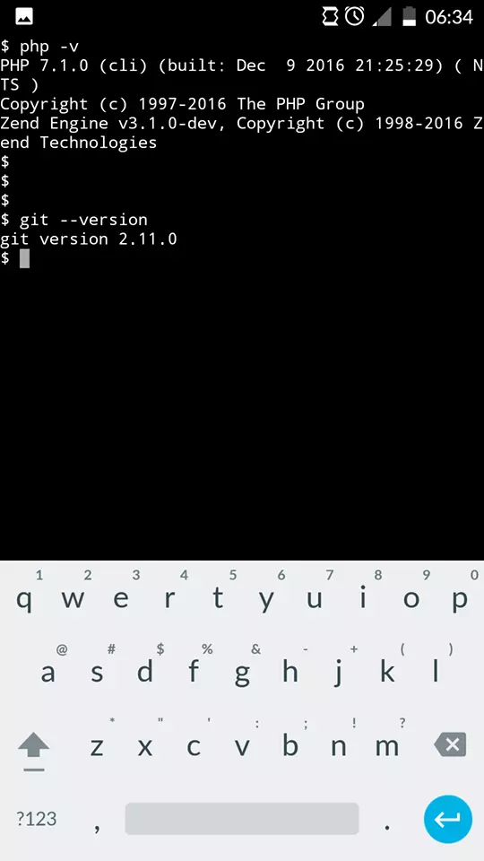

---
author:
  nick: Unknown
  link: ""
  email: noreply@blogger.com
category:
  - Programming
  - PHP
comments: true
cover: https://res.cloudinary.com/dimaslanjaka/image/fetch/https://4.bp.blogspot.com/-3UATHL878wU/WKoXE11tarI/AAAAAAAAFAA/QhBnNJFo5QAiB4C04RKBG9zuFrP2Uhm4gCLcB/s1600/serverphp.jpg
date: 2017-04-09T13:26:00.001+07:00
lang: en
location: ""
modified: 2020-01-24T06:50:22.992+07:00
subtitle: Official php-cli installation on android by L3n4r0x php Running On
  Android Terminal -> This Repost From My Another Blogs <-
tags:
  - PHP
  - Android
title: Install PHP for Android CLI or Web Server
type: post
uuid: 14e9225b-f78d-4888-85cc-de9f5862689c
webtitle: WMI Gitlab
updated: 2020-01-24T06:50:22+07:00
thumbnail: https://res.cloudinary.com/dimaslanjaka/image/fetch/https://4.bp.blogspot.com/-3UATHL878wU/WKoXE11tarI/AAAAAAAAFAA/QhBnNJFo5QAiB4C04RKBG9zuFrP2Uhm4gCLcB/s1600/serverphp.jpg
photos:
  - https://res.cloudinary.com/dimaslanjaka/image/fetch/https://4.bp.blogspot.com/-3UATHL878wU/WKoXE11tarI/AAAAAAAAFAA/QhBnNJFo5QAiB4C04RKBG9zuFrP2Uhm4gCLcB/s1600/serverphp.jpg
description: Official php-cli installation on android by L3n4r0x php Running On
  Android Terminal -> This Repost From My Another Blogs <-
excerpt: Official php-cli installation on android by L3n4r0x php Running On
  Android Terminal -> This Repost From My Another Blogs <-
wordcount: 1488
---

  

    Official php5-cli installation on android by L3n4r0x (php Running On Android Terminal) -&gt; This Repost From My Another Blogs &lt;- You can visit it on http://blog.snfr.cf or
    http://secretnetworkforces.blogspot.com
  

  
  

    <h2>How to install php5-cli in android</h2>
    <h5>Requirement:</h5>
  

  <ol>
    <li>
      Busybox For Programming Support (
      <a href="//webmanajemen.com/page/safelink.html?url=aHR0cHM6Ly9zZWNyZXRuZXR3b3JrZm9yY2VzLmJsb2dzcG90LmNvLmlkLzIwMTcvMDIvYnVzeWJveC1mb3ItcHJvZ3JhbW1pbmctc3VwcG9ydC5odG1sP209MQ==" target="_blank" rel="nofollow noopener"> Read And See Here</a>)
    </li>
    <li>
      Terminal Emulator (
      <a href="//webmanajemen.com/page/safelink.html?url=aHR0cDovL2FuZHJvaWQtdGVybWluYWwtZW11bGF0b3IuaWQudXB0b2Rvd24uY29tL2FuZHJvaWQvZG93bmxvYWQmdXNnPUFMa0pyaGdvN0Q0cTVKbEl1RnlneWVENUd6ZE42bFVrTnc=" rel="nofollow noopener" target="_blank">
        Download Terminal Emulator</a>)
    </li>
    <li>
      &nbsp; &nbsp; &nbsp; &nbsp; Code
      BB&nbsp;For PHP Server ( <a href="//webmanajemen.com/page/safelink.html?url=aHR0cHM6Ly93d3cxMi56aXBweXNoYXJlLmNvbS92L1pmWjU5UWtoL2ZpbGUuaHRtbA==" target="_blank" rel="nofollow noopener"> Download Server For PHP APK </a> )
    </li>
    <li>Internal min ± 300 MB free</li>
    <li>ROOT Explorer ( <a href="//webmanajemen.com/page/safelink.html?url=aHR0cHM6Ly9yb290ZXhwbG9yZXIuY28vd3AtY29udGVudC91cGxvYWRzLzIwMTYvMTEvUm9vdC1FeHBsb3Jlci00LjAuNS5hcGs=" target="_blank" rel="nofollow noopener"> Download Root Explorer Pro </a> )</li>
  </ol>
   
  <h3></h3>
  <h3>Installation:</h3>
  
1. Install Busybox and The Module

  
2. Install Server Module For PHP and its php

  
3. Open Terminal Emulator, type the following code this:

  
 

  

    <pre> su data="/data/data/com.eminis.server.php" chmod 755 $data/files/* chmod 755 $data/lib/* </pre>
    Or you can also manually set permissions 755 in
    /data/data/<a href="http://web-manajemen.blogspot.com/search?q=com.eminis.server.php" target="_blank">com.eminis.server.php</a>/ all the files in the folder "files"
    and "lib"  
     
    4. Open Root Explorer, open the folder /data/data/com.eminis.server.php/files/, "press and hold" file named php. (See screenshot)  
     
    <table align="center" cellpadding="0" cellspacing="0">
      <tbody>
        <tr>
          <td>
            
          </td>
        </tr>
        <tr>
          <td>Click hold, then click on the option menu (top right corner)</td>
        </tr>
      </tbody>
    </table>
     
    <table align="center" cellpadding="0" cellspacing="0">
      <tbody>
        <tr>
          <td>
            
          </td>
        </tr>
        <tr>
          <td>Click on the options menu, select the "link to this file"</td>
        </tr>
      </tbody>
    </table>
    
 

    
Once the link is copied, immediately go to the dir /system/bin/ (see screenshot)

     
    <table align="center" cellpadding="0" cellspacing="0">
      <tbody>
        <tr>
          <td>
            
          </td>
        </tr>
        <tr>
          <td>/System/bin/ click I marked above</td>
        </tr>
      </tbody>
    </table>
    Done. Try test open the Terminal emulator. Type the following code:  
    <pre>
    php -v
    php --help
    </pre>
    <table align="center" cellpadding="0" cellspacing="0">
      <tbody>
        <tr>
          <td>
            
          </td>
        </tr>
        <tr>
          <td>
            Installation Results Above  
             
          </td>
        </tr>
      </tbody>
    </table>
    <h4 style="text-align: left">[*] Features:</h4>
  

  

    * Pure PHP v.5.4+ - v.7+ server with modules: 
    core | session | standard | date | ereg | libxml | openssl | PCRE | sqlite3 | zlib | bcmath | bzip2 | calendar | ctype | curl | dom | hash | fileinfo | filter | ftp | gd | gettext | gmp | spl |
    iconv | intl | json | mbstring | mcrypt | mongodb | mysqlnd | mysqli | oDBC | pdo | pdo_mysql | pdo_odbc | pdo_pgsql | pdo_sqlite | pgsql | Phar | posix | pspell | recode | reflection | mysql |
    simplexml | soap | sockets | exif | tidy | tokenizer | WDDX | xml | XmlReader | xMLRPC | XMLWriter | xsl | zip | cli_server | mhash ssh2 | opcache | Phalcon | yaf | yar | iD3 | lzf | oauth |
    quickhash | bbcode | xmldiff | xdiff | rar | gender | stats | EIO | judy | mailparse | rpmreader | spl_types | yaml | ev | inotify | weakref | xdebug | dba | Imagick
  

  
 

  

    ! If you need MySQL or MariaDB Server:
    <a href="//webmanajemen.com/page/safelink.html?url=aHR0cHM6Ly9wbGF5Lmdvb2dsZS5jb20vc3RvcmUvYXBwcy9kZXRhaWxzP2lkPWNvbS5lc21pbmlzLnNlcnZlci5tYXJpYWRi" target="_blank" rel="nofollow noopener">Download MariaDB Server For Android</a> 
    ! If you need MongoDB Server - moNERIngAo Server:&nbsp;<a href="//webmanajemen.com/page/safelink.html?url=aHR0cHM6Ly9wbGF5Lmdvb2dsZS5jb20vc3RvcmUvYXBwcy9kZXRhaWxzP2lkPWNvbS5lc21pbmlzLnNlcnZlci5tb25nb2Ri" target="_blank" rel="nofollow noopener">Download MongoDB Server For Android</a>
  

  

    So <a href="//webmanajemen.com/page/safelink.html?url=aHR0cHM6Ly9nb29nbGUubmwvc2VhcmNoP3E9aW5zdGFsbCtwaHAtY2xpK0wzbjRyMHg=" rel="nofollow noopener" target="_blank"> I Install PHP in Android | </a>
    <a href="//webmanajemen.com/page/safelink.html?url=aHR0cHM6Ly9nb29nbGUudGsvc2VhcmNoP3E9aW5zdGFsbCtwaHAtY2xpK0wzbjRyMHg=" rel="nofollow noopener" target="_blank"> Php run in a terminal emulator android </a> . Hope it helps, when confused comments only. Or call me
    at <a href="//webmanajemen.com/page/safelink.html?url=aHR0cHM6Ly9mYi5tZS9kaW1hc2xhbmpha2Ex" target="_blank" rel="nofollow noopener"> Dimas Imam Nawawi (Dimas Lanjaka) </a> .
  

Tag: Install PHP cli android, Install PHP Cli for android, How to install php cli on android, android php command line interface.

