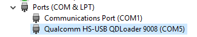

<h1 id="fix-frp-redmi-go-latest-security-patch-updated-2022" tabindex="-1"><a class="header-anchor" href="#fix-frp-redmi-go-latest-security-patch-updated-2022">Fix FRP Redmi GO Latest Security Patch (Updated 2022)</a></h1>

<ul>
<li>Download Firmware redmi go <code>tiare_global_images_V10.2.6.0.OCLMIXM_8.1</code> customized with <code>frp bypasser</code></li>
</ul>
<blockquote>

<a href="https://mega.nz/file/OEFVBYJD#ptfhr6ADL6vwFu9ZikLnUkJqu9RfS-dUtBfvzDU_qMw">Download Firmware Redmi GO Tiare FRP Fix From MEGA</a>

</blockquote>
<h2 id="edl-mode" tabindex="-1"><a class="header-anchor" href="#edl-mode">EDL Mode</a></h2>
<ul>
<li>Open Back Cashing Redmi Go Tiare M1903C3GG And Connect Two Point (Look at this screenshot)
</li>
<li>Connect USB while connected two points above</li>
<li>EDL Mode Loaded as Qualcom HS-USB QDLoader (Look at this screenshot)
</li>
</ul>
<h2 id="flashing" tabindex="-1"><a class="header-anchor" href="#flashing">Flashing</a></h2>
<ul>
<li>Open MiFlash</li>
<li>Select Firmware <code>tiare_global_images_V10.2.6.0.OCLMIXM_8.1\images</code>
</li>
<li>Select Option <code>CLEAN ALL</code> at bottom
</li>
<li>Tap <code>refresh</code> if your REDMI GO not shown</li>
<li>Tap <code>flash</code> if your REDMI GO ready</li>
</ul>
