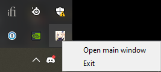

---
author:
  nick: Dimas Lanjaka
  link: https://github.com/dimaslanjaka
category:
  - Games
  - Genshin Impact
cover: /Genshin Impact/Update/update-genshin-impact-1.5.1-1.6.0/cover.jpg
date: 2021-11-26T00:00:00+07:00
lang: en
location: Indonesia
subtitle: Update Genshin Impact 2.1.0 - 2.3.0 Manual
tags:
  - Games
  - Genshin Impact
title: Update Genshin Impact 2.3.0 Manual
type: post
uuid: dae70e1a-6ea2-4888-8409-ebbcd9a13c41
webtitle: WMI Genshin Impact
updated: 2021-11-27T10:38:39+07:00
thumbnail: /Genshin Impact/Update/update-genshin-impact-1.5.1-1.6.0/cover.jpg
photos:
  - /Genshin Impact/Update/update-genshin-impact-1.5.1-1.6.0/cover.jpg
description: Update Genshin Impact 2.1.0 - 2.3.0 Manual
excerpt: Update Genshin Impact 2.1.0 - 2.3.0 Manual
wordcount: 664
---

Update genshin impact `2.3.0` manual via download manager (IDM).

<!-- more -->

# Download Genshin Impact Patches

## [Patch 2.1.0 - 2.3.0](update-genshin-impact-2.1.0-2.3.0.html)
- [en-us_2.1.0_2.3.0_diff_9WOeMLlpzcFh7owj.zip](https://autopatchhk.yuanshen.com/client_app/update/hk4e_global/10/en-us_2.1.0_2.3.0_diff_9WOeMLlpzcFh7owj.zip)
- [game_2.1.0_2.3.0_diff_IFqrKCzDYyUt697g.zip](https://autopatchhk.yuanshen.com/client_app/update/hk4e_global/10/game_2.1.0_2.3.0_diff_IFqrKCzDYyUt697g.zip)
- [ja-jp_2.1.0_2.3.0_diff_8nXfsMArgbPOU30c.zip](https://autopatchhk.yuanshen.com/client_app/update/hk4e_global/10/ja-jp_2.1.0_2.3.0_diff_8nXfsMArgbPOU30c.zip)

## How to updating to 2.3.0
After you have all the files, you can start the updating process.
*   Firstly, open the **Genshin Impact** launcher, and make sure it is updated. This means, that the launcher version is updated, and not the game version. This is automatic, and you will be prompted.
*   Now, click on the **Update** button, and then click **Pause**, after a few seconds.
*   Close the launcher, and make sure it isn’t running in the background. You can also check if it is running in the taskbar, close it from there too.



> Genshin Impact running in the taskbar > right click > exit

Now,
* go to the following location **C:\\Program Files\\Genshin Impact\\Genshin Impact Game\\**
* delete all the **.zip\_tmp files** if exists ( _temp files that were downloaded when you hit the Update button_ )
* Copy all the files you downloaded in the “Required Downloads” section, and paste them in the following location ( _the patch file for 2.3.0, and the audio files_) **C:\\Program Files\\Genshin Impact\\Genshin Impact Game\\** _(or wherever the game is installed, just make sure it is in the Genshin Impact Game folder)_
* Open the launcher, and it will say **Pre-installation done**

### Important things to **note**
*   **DON’T EXTRACT THE FILES** . If you extract the files, you won’t be able to play it until 2.3.0 is live. We recommend you don’t do that.
*   **Pre-installation done** means that you can keep playing the **Genshin Impact game** until the patch is live
*   If you are following this guide after the patch is live, it will say **Update** instead of **Pre-installation done**. Click that, and it will install the files you downloaded above

## Simple way
- Download Update Version Or Full Game Version
- Copy all to your Genshin Impact\Genshin Impact Game\ folder

```
.. Preview Example::
.
|-- C:
    |-- Program Files
        |-- Genshin Impact
            |-- Genshin Impact Game
                |-- game_..._diff_H8LGSgKU.zip
                |-- ja-jp_..._diff_hfBOW6ym.zip
                |-- ko-kr_..._diff_NcX8UP1L.zip
                |-- en-us_..._diff_KdXT5Pi0.zip
                `-- zh-cn_..._diff_hvg2F3QM.zip
```

## Screenshot


# Older Patches

## [Patch 2.0.0 - 2.1.0](update-genshin-impact-2.0.0-2.1.0.html)
- [en-us_2.0.0_2.1.0_diff_n8EeG923ZU1BPcgq.zip](https://autopatchhk.yuanshen.com/client_app/update/hk4e_global/10/en-us_2.0.0_2.1.0_diff_n8EeG923ZU1BPcgq.zip)
- [game_2.0.0_2.1.0_diff_kYU5QpgOiPB1woI4.zip](https://autopatchhk.yuanshen.com/client_app/update/hk4e_global/10/game_2.0.0_2.1.0_diff_kYU5QpgOiPB1woI4.zip)
- [ja-jp_2.0.0_2.1.0_diff_Ub6DpehQk19xKEVa.zip](https://autopatchhk.yuanshen.com/client_app/update/hk4e_global/10/ja-jp_2.0.0_2.1.0_diff_Ub6DpehQk19xKEVa.zip)

## [Patch 1.6.1 - 2.0.0](update-genshin-impact-1.6.1-2.0.0.html)

- [en-us_1.6.1_2.0.0_diff_pa7XSfuvwheYHlR4.zip](https://autopatchhk.yuanshen.com/client_app/update/hk4e_global/10/en-us_1.6.1_2.0.0_diff_pa7XSfuvwheYHlR4.zip)
- [game_1.6.1_2.0.0_diff_GLrkVi02eEIJHmoZ.zip](https://autopatchhk.yuanshen.com/client_app/update/hk4e_global/10/game_1.6.1_2.0.0_diff_GLrkVi02eEIJHmoZ.zip)
- [ja-jp_1.6.1_2.0.0_diff_Rr1nlK3O0Wjgo4M2.zip](https://autopatchhk.yuanshen.com/client_app/update/hk4e_global/10/ja-jp_1.6.1_2.0.0_diff_Rr1nlK3O0Wjgo4M2.zip)
- [ko-kr_1.6.1_2.0.0_diff_YHsxbir0lqzcvNIk.zip](https://autopatchhk.yuanshen.com/client_app/update/hk4e_global/10/ko-kr_1.6.1_2.0.0_diff_YHsxbir0lqzcvNIk.zip)
- [zh-cn_1.6.1_2.0.0_diff_kxn7JGptOMsUWeXf.zip](https://autopatchhk.yuanshen.com/client_app/update/hk4e_global/10/zh-cn_1.6.1_2.0.0_diff_kxn7JGptOMsUWeXf.zip)

## [Patch 1.6.0 - 1.6.1](update-genshin-impact-1.6.0-1.6.1.html)

- [en-us_1.6.0_1.6.1_diff_hfuFbIATOe16BZwW.zip](https://autopatchhk.yuanshen.com/client_app/update/hk4e_global/10/en-us_1.6.0_1.6.1_diff_hfuFbIATOe16BZwW.zip)
- [game_1.6.0_1.6.1_diff_nUOVRNMH4fb1tJsC.zip](https://autopatchhk.yuanshen.com/client_app/update/hk4e_global/10/game_1.6.0_1.6.1_diff_nUOVRNMH4fb1tJsC.zip)
- [ja-jp_1.6.0_1.6.1_diff_8fK2vdMnkmsHEO4e.zip](https://autopatchhk.yuanshen.com/client_app/update/hk4e_global/10/ja-jp_1.6.0_1.6.1_diff_8fK2vdMnkmsHEO4e.zip)
- [ko-kr_1.6.0_1.6.1_diff_bfFmUj9kRoEZIuWz.zip](https://autopatchhk.yuanshen.com/client_app/update/hk4e_global/10/ko-kr_1.6.0_1.6.1_diff_bfFmUj9kRoEZIuWz.zip)
- [zh-cn_1.6.0_1.6.1_diff_spTaeOM64imbcLGw.zip](https://autopatchhk.yuanshen.com/client_app/update/hk4e_global/10/zh-cn_1.6.0_1.6.1_diff_spTaeOM64imbcLGw.zip)

## Full Game

- [GenshinImpact_1.1.0.zip](https://autopatchhk.yuanshen.com/client_app/pc_mihoyo/20201111_8e266b33e565ddf8/GenshinImpact_1.1.0.zip)
- [GenshinImpact_1.4.0.zip](https://autopatchhk.yuanshen.com/client_app/pc_mihoyo/20210317_67c8f1002bb26672/GenshinImpact_1.4.0.zip)
- ## 1.5.1
- - [GenshinImpact_1.5.1.zip](https://autopatchhk.yuanshen.com/client_app/pc_mihoyo/20210430_27ad367085356fd4/GenshinImpact_1.5.1.zip)
- - [Audio_English(US)\_1.5.1.zip](<https://autopatchhk.yuanshen.com/client_app/pc_mihoyo/20210430_27ad367085356fd4/Audio_English(US)_1.5.1.zip>)
- - [Audio_Korean_1.5.1.zip](https://autopatchhk.yuanshen.com/client_app/pc_mihoyo/20210430_27ad367085356fd4/Audio_Korean_1.5.1.zip)
- - [Audio_Japanese_1.5.1.zip](https://autopatchhk.yuanshen.com/client_app/pc_mihoyo/20210430_27ad367085356fd4/Audio_Japanese_1.5.1.zip)
- - [Audio_Chinese_1.5.1.zip](https://autopatchhk.yuanshen.com/client_app/pc_mihoyo/20210430_27ad367085356fd4/Audio_Chinese_1.5.1.zip)

## Another Components

- [DXSETUP.zip](https://autopatchhk.yuanshen.com/client_app/plugins/DXSETUP.zip)

# Old Version

## Chinesse Version

- [YuanShen_1.2.0.zip](https://autopatchhk.yuanshen.com/client_app/update/hk4e_global/10/YuanShen_1.2.0.zip)

## Patch v.1.5.0 - v.1.5.1

- [en-us_1.5.0_1.5.1_diff_Gg3Q5aOK.zip](https://autopatchhk.yuanshen.com/client_app/update/hk4e_global/10/en-us_1.5.0_1.5.1_diff_Gg3Q5aOK.zip)
- [game_1.5.0_1.5.1_diff_MF8HJNzT.zip](https://autopatchhk.yuanshen.com/client_app/update/hk4e_global/10/game_1.5.0_1.5.1_diff_MF8HJNzT.zip)
- [ja-jp_1.5.0_1.5.1_diff_P72LxVCa.zip](https://autopatchhk.yuanshen.com/client_app/update/hk4e_global/10/ja-jp_1.5.0_1.5.1_diff_P72LxVCa.zip)
- [ko-kr_1.5.0_1.5.1_diff_4wMycdN3.zip](https://autopatchhk.yuanshen.com/client_app/update/hk4e_global/10/ko-kr_1.5.0_1.5.1_diff_4wMycdN3.zip)
- [zh-cn_1.5.0_1.5.1_diff_2heO3D7V.zip](https://autopatchhk.yuanshen.com/client_app/update/hk4e_global/10/zh-cn_1.5.0_1.5.1_diff_2heO3D7V.zip)

| Title    |                            URL                             |
| -------- | :--------------------------------------------------------: |
| Blog     |        [webmanajemen.com](https://webmanajemen.com)        |
| Git Page |    [www.webmanajemen.com](https://www.webmanajemen.com)    |
| GitHub   | [github.com/dimaslanjaka](https://github.com/dimaslanjaka) |